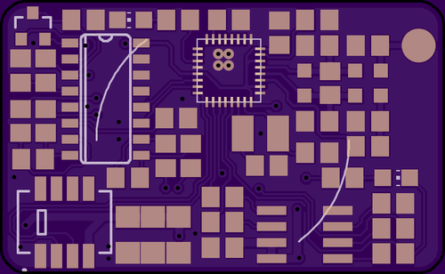
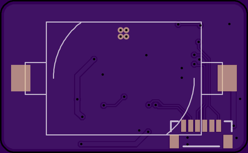

# NukeNanny
Sensor Node for beehive data collection. 433mhz radio. temp/humidity/ optionally weight.

## Sensors
 * Humidity/Temp (SHT1X)
 * two optional load cells (HX711)

## Radio
 * 433mhz nrf9e5 8051 CPU + Radio
 * 10dBm Tx. 10mm helical antenna 2.5dBi
 
## Battery
 * CR2032 (225mAh)
 * [Rough power budget](https://docs.google.com/spreadsheets/d/1PkM406ndirrwiI1R5EvJM8zMfThP9lIQZCE76__e_ts/edit?usp=sharing) (avg draw 16uA)

